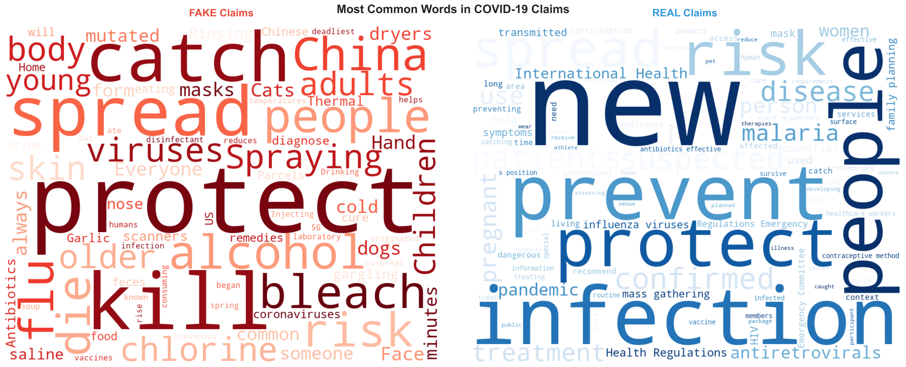
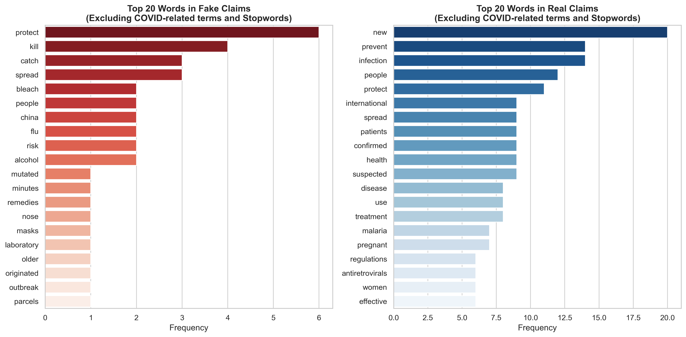
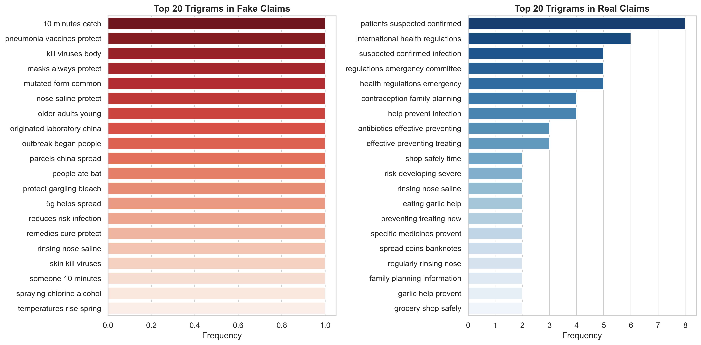
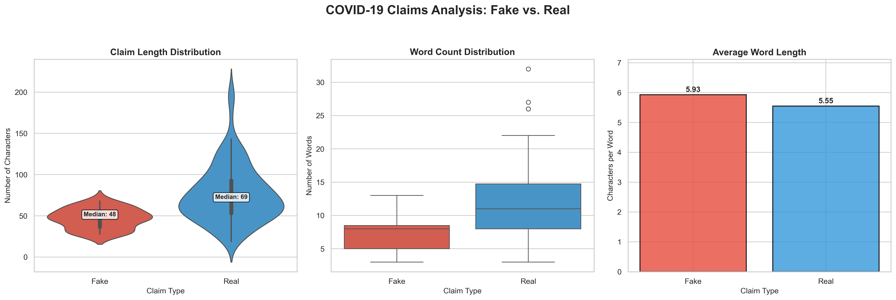
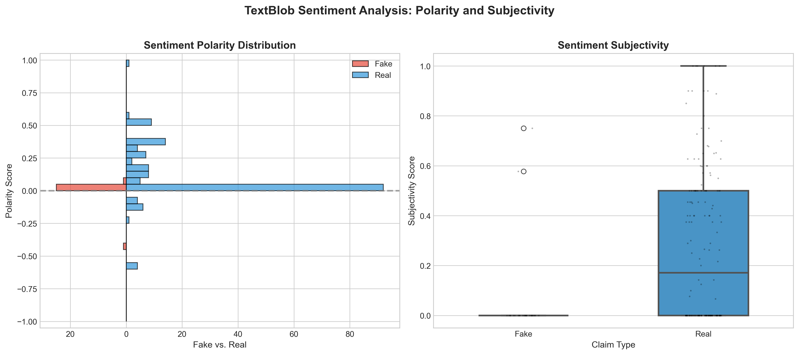
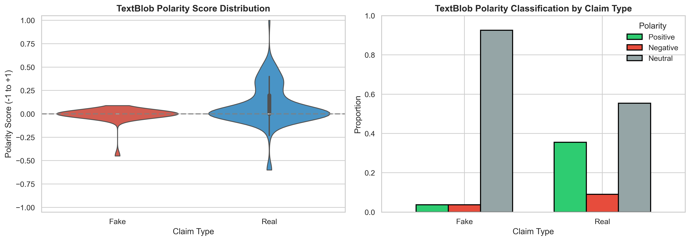
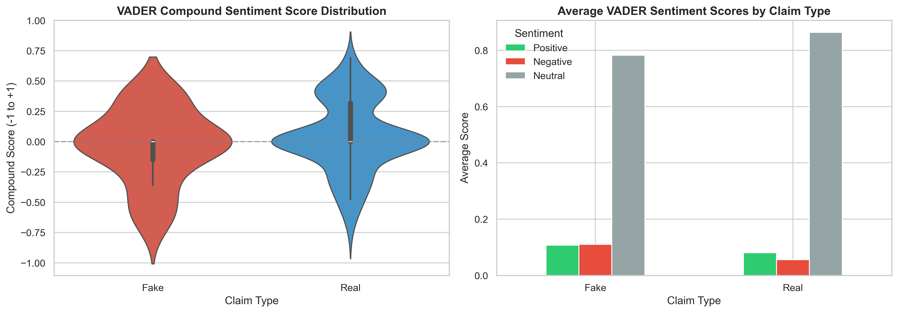
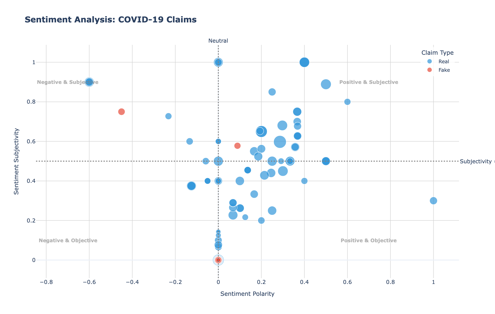
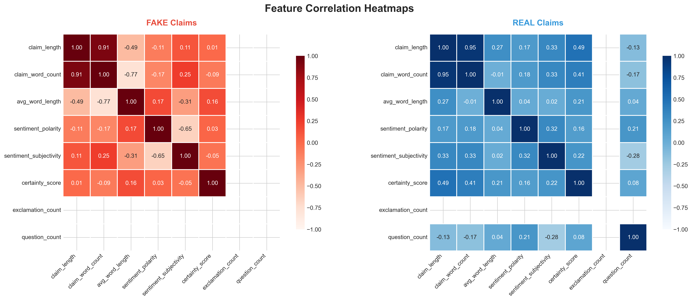

\maketitle

# Introduction

With the current rise in internet and the increase in social media use, misinformation in every sector spreads faster than anyone could think of, even faster than the truth. In as much as all sectors are important, misinformation in the public health sector is problematic as it could lead to disaster that could possibly shut down a system as public belief in health misinformation for diseases such as infectious diseases could lead to people engaging in behaviors such as avoiding vaccination, avoiding health care assistance, taking harmful medication or remedies misinformed to be effective which could put their life and the life of other people around them at risk. There has been a call by the World Health Organization, the US surgeon General, American Medical Association and many other professional societies on the need to pay closer attention to this threat to public health and mitigate its spread (Ontario Hospital Association [OHA], 2023). According to the World Economic Forum’s 2013 Global Risks Report, digital misinformation was identified as a global threat even before the COVID-19 pandemic. During the COVID-19 pandemic, the reliance on social media as the main source of information came along with a notable increase in the spread of misinformation and disinformation. These false information spreads faster on social media than original news leading to the pattern of vaccine hesitancy and resisting important COVID-19 health measures from the public (Rodrigues et al., 2024).

Thus, this study aimed at exploring the characteristics of news headlines and identify top used keywords for fake and real COVID-19 news topic. Being able to identify the distinguishing characteristics of a fake versus real news will enable the public to better recognize misinformation and sheer away from reading or sharing such content.

# Related Work

A summary of research related to fake data detection, visualizations, and misinformation analysis is presented in this section.

In a study conducted by Chen et al. (2022) on charting the Information and Misinformation Landscape to Characterize Misinfodemics on social media: COVID-19 Infodemiology Study at a Planetary Scale using tweets related to COVID-19 collected between January 2020 and April 2021. Their study investigated the trends of misinformation, how this misinformation circulates and identifies twitter audience that are more prone to spread fake news about COVID-19. This study approached this by first subsetting tweets that contains links from websites identified by Media Bias/Fact Check as sources of questionable or false information and then applying clustering (temporal clustering of bigrams word pairs) to identify 11 major topics discussed in tweets ) and topic-modeling method (Latent Dirichlet Allocation (LDA)) to detect health misinformation and conspiracies including false claims about COVID-19 prevention measures, hydroxychloroquine, alternative medicines, and the United States government officials and governing agencies. Their analysis found that users who shares misinformation clusters together which is in support of their hypothesis that echo chambers can contribute to the spread of health misinfodemics.

In a research conducted by Dubey (2020) on Twitter sentimental analysis to understand how different people in various countries are dealing with the COVID19 outbreak. This study used the NRC emotion lexicon to analyze positive and negative polarity, they detected eight emotions including anger, anticipation, disgust, fear, joy, sadness, surprise and trust. Word cloud was used to detect the words that was frequently used by users from the different countries.

A similar study by Gravanis, Vakali, Diamantaras, and Karadais (2019) proposed a fake news detection model that uses content-based features and machine learning algorithms to detect which linguistic features lead to high accuracy results in fake news detection, see which combinations of word embeddings and linguistics features lead improve the performances of fake news detection and also determine the algorithm that is best for identifying fake news. Their result showed classification of fake news has a high accuracy when enhanced linguistic features with word embeddings, ensemble algorithm and support vector machine was used.

# Methods

## Dataset

The dataset used for this project is the COVID-19 Healthcare Misinformation Dataset (CoAID) which contains fake and real news from websites and social media platforms. This datafile contains 4,251 news articles, 296,000 user engagements with these articles, 926 social media posts related to COVID-19, and ground truth labels for all content. However, this project only used analyzed the claim fake and real titles for 5th of January 2020 (193 claims (27 fake, 166 real)).

## Data Processing and Feature Engineering

Both the verified fake and real title dataset was combined to create a single dataset for the analysis. This dataset was then processed to extract the linguistic, semantic and structural indicators that could help in identifying which of the two datasets are real or fake. Based on the combined dataset, we calculated the

-   **Claim Length**: This measures how short or long a title is and is calculated by counting the total number of characters in each title.
-   **Word Count**: This counts the number of words in a title
-   **Average word length**: This is the mean number of characters per word, and it helps to determine if fake or real title use simple or advanced words, giving an insight into the lexical complexity of the claim. This is calculated by dividing the Claim length i.e. the total letters by the number of words.

## Sentiment Analysis

Sentiment analysis was applied to capture emotional tone and opinion strength of each claim title. Two Python libraries were used for the sentiment analysis: TextBlob and VADER.

-   **TextBlob**: This a natural language processing library in Python to determine the emotional claim in each of the title. It is a lexicon- and rule-based tool that uses a predefined dictionary of words with polarity scores. This function calculates polarity (measures overall emotional tone, values from -1 (negative) to +1 (positive)) and subjectivity (measures how opinion based the claim is, values from 0 (objective) to 1(subjective)). Both variables were visually explored to see how they differ between the real and the fake titles. We note that this function captures general emotional orientation but is less sensitive to punctuation or capitalization.

-   **VADER (Valence Aware Dictionary and Sentiment Reasoner)**: Valence measures the emotional quality of each word. Designed for short, social-media-like texts and effective for claims and headlines. It computes a Weighted normalized score (Compound) from −1 (most negative) to +1 (most positive). The compound score is divided into Positive, Negative, Neutral Proportions of sentiment within text (Classification thresholds: Positive (≥ 0.05), Neutral (−0.05 to 0.05), Negative (≤ −0.05)). This method Considers intensifiers, negations, punctuation (e.g., !!!), and capitalization for context-aware interpretation.

## Certainty Language Detection

This project creates a list of certainty related words that are often encountered in fake news such as, absolutely, certainly, always, never, proven, confirmed, fact, truth, 100%, completely, undeniable, undoubtedly, obviously, clearly, guaranteed, irrefutable, incontrovertible, beyond doubt, evident, infallible, verified, validated, scientifically proven, official, and decisive to determine how assertive the news title were. The dataset was checked to determine occurrence of these words, and a certainty score was calculated by counting the number of certainty words present. A higher certainty score may indicate persuasive or misleading intent.

## Punctuations and Question Marks

Since fake data most times often use exaggerated punctuation to grab attention (e.g., Can this cure COVID-19?!). The fake and real titles were also analyzed by counting the number of questions and exclamation mark that occurred in a sentence, then a binary variable was created to determine if the title has either punctuation or question marks.

## Visualization Techniques

The variables created will be visualized using the Matplotlib and the Seaborn library. Violin and box plots will be used to show the distribution for claim length, word count and subjectivity while a bar plot will be used to look at the distribution of the average word length for both the fake and the real title claim. A sentiment density plot is used to visualize the polarity differences. Using Plotly, an interactive scatterplot was created to visualize sentimental polarity and subjectivity. A qualitative analysis was performed using the word cloud library to identify the thematic and lexical difference between the fake and real claims title. For clear identification of common words, stopwords and domain specific terms such as covid, coronavirus, 19, pandemic, claim, says, and said were removed

# Results Analysis

The side-by-side word cloud shows the most common words that was used in the title of the news articles. This allows us to observe the distinct patterns between fake and real COVID-19 news. For the fake news title, most common words were alcohol, risk, kill, spread, China, catch, cure, bleach which varies across linguistics such as fears, false treatment claims, misinformation, geographical blame. The real claims (Blue) show words such as people, prevent, protect, patients, pregnant which span linguistics features such as medical terminologies like infections, spread, antiretrovirals, malaria, protection and prevention et al.

```{r, echo=FALSE, out.width="\\columnwidth", fig.align='center', fig.cap="Figure 1: Most Common Words in COVID-19 Headlines"}

```

This bar plot shows the top 20 single words that were commonly used for both the fake and the real news title.

```{r, echo=FALSE, out.width="\\columnwidth", fig.align='center', fig.cap="Figure 2: 20 Most Common Words in COVID-19 Headlines"}

```

This bar plot shows the top 20 Bi words that were commonly used for both the fake and the real news title.

```{r, echo=FALSE, out.width="\\columnwidth", fig.align='center', fig.cap="Figure 3: 20 Most Common Bigram Words in COVID-19 Headlines"}
knitr::include_graphics("viz3_barplot2.png")
```

This bar plot shows the top 20 Tri words that were commonly used for both the fake and the real news title.

```{r, echo=FALSE, out.width="\\columnwidth", fig.align='center', fig.cap="Figure 4: 20 Most Common Trigram Words in COVID-19 Headlines"}

```

The dashboard below shows the distribution of claim length, word count and average word length across fake and real news title. The violin plot of claim length distribution shows that the number of characters in a fake claim tends to be shorter (Median = 48) than in a real claim (Median = 69). We also observed the same patterns in the total number of words contained in both fake and real title, real title contains more words to fake title. However, the average character per word for both news title is similar (an average of about 6 characters per word). Overall, this result provided some evidence that fake titles are short, while real titles are longer and more detailed

```{r, echo=FALSE, out.width="\\columnwidth", fig.align='center', fig.cap="Figure 5: Dashboard showing the distribution of character, and word count"}

```

Both plots in this section shows how sentiment polarity and subjectivity differ between fake and real claim title based on the TextBlob sentiment approach. Result from the plot shows fake title is clustered around zero (neutral polarity) with one title each in both negative and positive polarity. The distribution for real title was however wider as we saw more neutral and positive polarity value. This suggest that fake title doesn’t carry any emotion, or we say the wordings are mostly neutrally possibly because the number of words are short. However, real title shows more variability in emotion. The boxplot shows that fake news is objective (most values at 0) with two showing higher subjectivity score while real claims mostly show higher subjectivity.

```{r, echo=FALSE, out.width="\\columnwidth", fig.align='center', fig.cap="Figure 6: Polarity and Subjectivity for Sentiment Analysis (Textblob)"}

```

```{r, echo=FALSE, out.width="\\columnwidth", fig.align='center',fig.cap="Figure 7: Polarity for Textblob"}

```

The result from the VADER package shows almost similar compound sentiment score for both real and fake title data. Both plots look symmetrical and are centered around zero. The wide distribution observed with fake claim could be due to use of both positive and emotional language to manipulate emotions of readers.

```{r, echo=FALSE, out.width="\\columnwidth", fig.align='center', fig.cap="Figure 8: Sentiments in the Vader lexicon for each class"}

```

For the scatter plot below, we saw that the positive and subjective (emotional appeal, beliefs, opinions, suspicion, speculations) were mostly dominated by the real title, same as positive and objective (factual). No fake title was seen in the positive and objective quadrant, but we saw a single point title present in positive and subjective. Most of the titles in the fake title are neutral.

```{r, echo=FALSE, out.width="\\columnwidth", fig.align='center', fig.cap="Figure 9: Scatter Plot for the Sentiment Analysis"}

```

The heatplot as shown below investigates the association between claim length, claim word length, average word length, sentiment polarity, subjectivity, certainty score, exclamation count and question count. The most interesting result was seen with the real claim plot. We saw a positive strong association between claim length and certainty score (r = 0.49), also word count and certainty score (r = 0.41). A moderate positive association was also observed between claim length, word count, and sentiment subjectivity. There was a negative association between polarity and claim length, word count for fake title, however a weak positive association was seen for the same variables in true title.

```{r, echo=FALSE, out.width="\\columnwidth", fig.align='center', fig.cap="Figure 10: Correlation Heatmap for claim length, claim word length, average word length, sentiment polarity, subjectivity, certainty score, exclamation count and question count"}

```

# Discussion
The plots created for this project (Figure 1-10) ranged from word cloud, box plot, violin plot, scatter plots, heatmaps which helped us to investigate what differentiates COVID-19 fake news title from real news title. Based on word cloud and boxplot shown in Figure 1 to 3 words such as alcohol, risk, kill, spread, bleach is some of the common words used in fake news title, these words instigate fear, false treatment to COVID19, geographical blame, and misinformation. Words used in the real news title are majorly around protection, information on new cases, Covid19 spread, and infections. With figure 5, it was easy for users to see how words used in fake and real news title differs numerical. The plot showed that the number of character contained in real data are shorter compared to the real news and this could be due to the fact that perpetrators of real news are only concerned about title that catches the audience and are more likely to use shorter ones compared to real news title that would want to be explicit as best as possible. To determine sentiment in the news title, the visual representation used to display the numbers gave a quick look into the difference between a fake and real news. The bar plot, violin plot, scattered plots all showed the distribution of title across polarity and subjectivity. It showed majority of the fake news for the dataset considered in this study have a neutral tone, this is quite unexpected but we believed this is due to we considering a single day news title and the number of tile for fake news was small (n = 27) compared to the real news that showed most of the title carries emotional appeal, beliefs, opinions, suspicion, speculations and also most of the title also falls into the factual quadrant. The heatplot (figure 10) also investigated how the number of words, number of characters relates with sentiment and certainty score between real and fake news. With our visualization, it was easier to see that for real news title, with higher word and character count comes an increased certainty score i.e. longer words are more certain. This suggests that real news title that are true are always more detailed. The numbers also showed that longer real news word or character are more subjective while for fake news, longer word showed negativity in tone as there was a negative association between polarity and word count. Overall, all of the visuals used for exploring the news title characteristics in this project made the numbers as clear as possible and it allows user to quickly determine characteristics associated with Fake and Real news title.

# Future Work
This project will be extended in the future to incorporate more days beyond January 5, 2020, to improve model generalization and reliability. Increasing the number of days will also directly increase the sample size for both fake and real news title, which reduces sampling bias and make our analysis more powerful. Interactive dashboard with an improved features such as emotional tone, modality, uncertainty will also be implemented

\balance
# References

\footnotesize

1.  Ontario Hospital Association. (2023, May). Misinformation in health care – The critical role of effective communication: Research brief. <https://www.oha.com/Bulletins/Misinformation%20in%20Health%20Care%20-%20The%20Critical%20Role%20of%20Effective%20Communication.pdf>

2.  Adebesin, F., Smuts, H., Mawela, T., Maramba, G., & Hattingh, M. (2023). The Role of Social Media in Health Misinformation and Disinformation During the COVID-19 Pandemic: Bibliometric Analysis. JMIR infodemiology, 3, e48620. <https://doi.org/10.2196/48620>

3.  Chen, E., Jiang, J., Chang, H. H. C., Muric, G., & Ferrara, E. (2022). Charting the information and misinformation landscape to characterize misinfodemics on social media: COVID-19 infodemiology study at a planetary scale. JMIR Infodemiology, 2(1), e32378. <https://doi.org/10.2196/32378>

4.  Rodrigues, F., Newell, R., Babu, G. R., Chatterjee, T., Sandhu, N. K., & Gupta, L. (2024). The social media infodemic of health-related misinformation and technical solutions. Health Policy and Technology, 13(2), 100846. <https://doi.org/10.1016/j.hlpt.2024.100846>

5.  Dubey, Akash Dutt, Twitter Sentiment Analysis during COVID-19 Outbreak (April 9, 2020). Available at SSRN: <https://ssrn.com/abstract=3572023>

6.  Gravanis, G., Vakali, A., Diamantaras, K., & Karadais, P. (2019). Behind the cues: A benchmarking study for fake news detection. Expert Systems with Applications, 128, 201-213. <https://doi.org/10.1016/j.eswa.2019.03.036>


